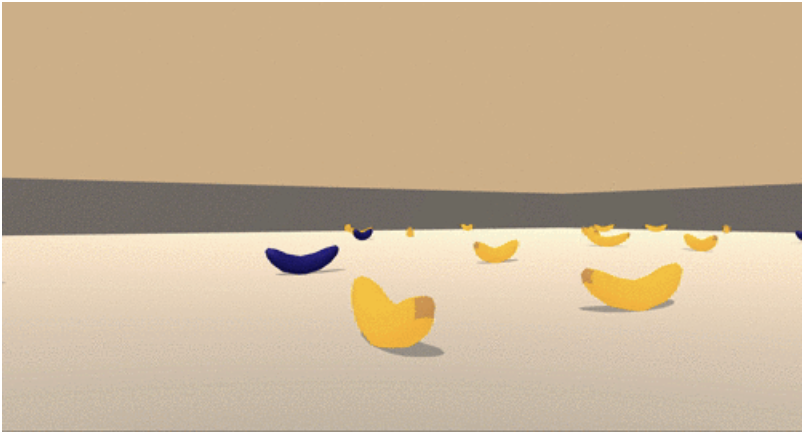

# Udacity reinforcement learning navigation project

A solution to the first project of Udacities Reinforcement Learning course.

## **Project details**

This projects runs from Jupyter and has all of the code required in order to train and play back an agent.

### Goal
The goal of the project is to train an agent to navigate and pick up as many yellow bannanas as possible.

### Rewards
You will receive a reward of +1 for collecting a yellow bannana and a reward of -1 for collecting a blue bannana.

### State
The state space consists of 37 dimentions and has a ray-based perception of objects in the agents forward direction.

### Actions
There are 4 different actions the agent can use which relates to:
- 0 Forward
- 1 Backward
- 2 Left
- 3 Right

### Solved
This project is solved if the agent scores more than 13 points over 100 consecutive episodes.

## **Getting started**

You will need to install [Anaconda](https://www.anaconda.com) in order to run through the following dependency instructions.

All of the dependencies for this project can be found at: https://github.com/udacity/deep-reinforcement-learning#dependencies

## Instructions

Inside of the Jupyter notebook, run the first code block to import all the necessary libraries to run the rest of the code blocks.

The second code block loads the Unity environement and specifies the brain name.

Deep_Q_Network (the third code block) is the deep network that is used within this project. It consists of dynamic hidden layers (so that you can change it while finding the best combination easier) and Relu activations functions.

Fourth code block is the Agent. The agent is used to determine the actions to take as well as interacts with the deep network to learn and better determine actions to increase environment rewards.

The training block runs through the specified episodes, receives the actions from the agent and passes it back to the environment.  It also saves the score and model if the score is more than what is specified in the checkpoint.

