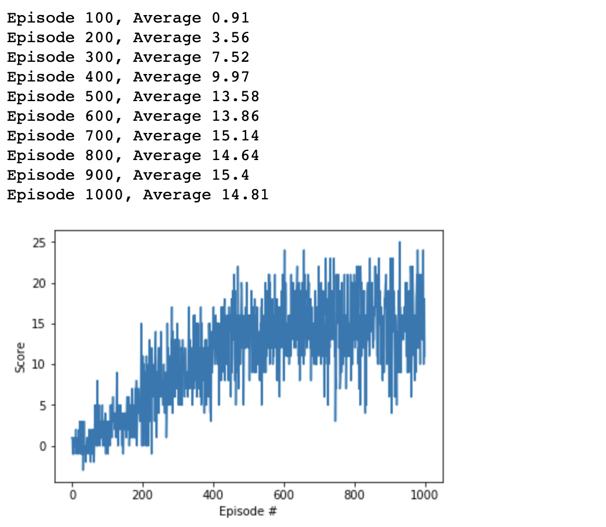

# Report

## Learning Algorithm

The algorithm used deep Q networks with fixed targets to train the agent on.

## Plot of Rewards

`checkpoint.pth` has a score of 17.35.

## Ideas for Future Work

This notebook can be easily adjusted to take in pixels as input layers and train the agent on frames from the Unity app.

The hyperparameters can be adjusted a bit more to improve the Agent score.